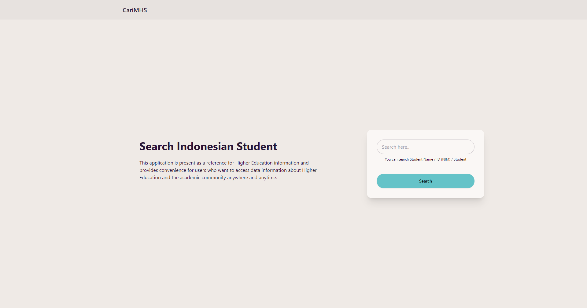
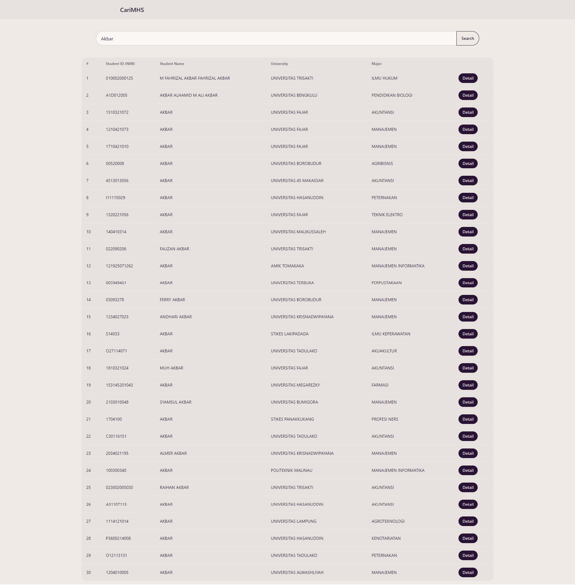
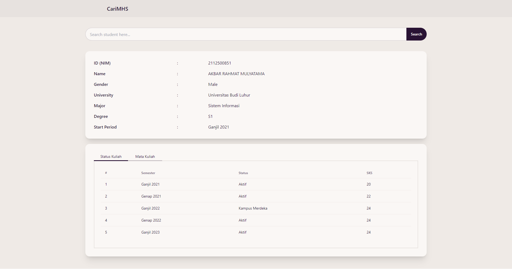
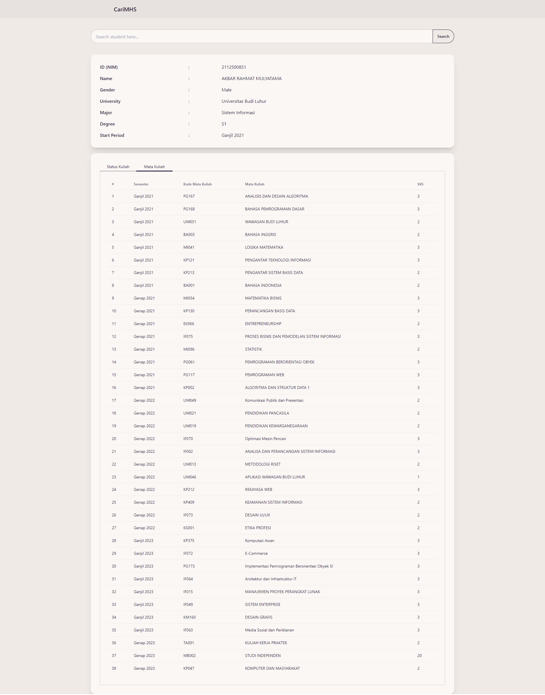

# CariMHS

This application is present as a reference for Higher Education information and provides convenience for users who want to access data information about Higher Education and the academic community anywhere and anytime.

## Tech Stack

- React.JS
- React Router DOM
- Vite
- Tailwind
- DaisyUI

## Preview

- Dashboard

     

- Search Student

     

- Student Detail (Academic Status)

     

- Student Detail (Courses)

     

